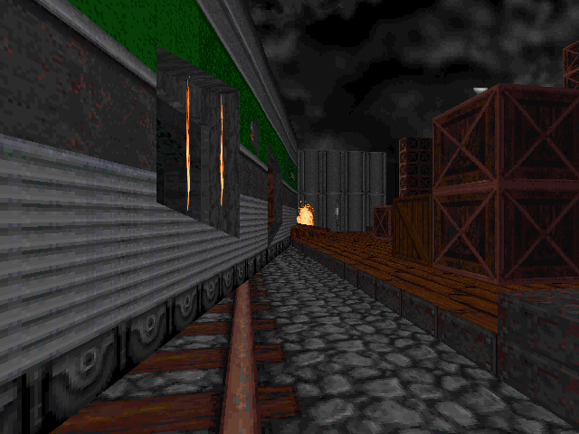
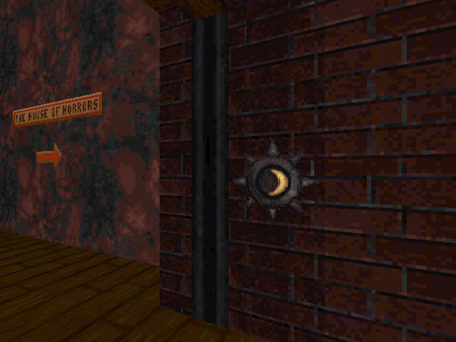
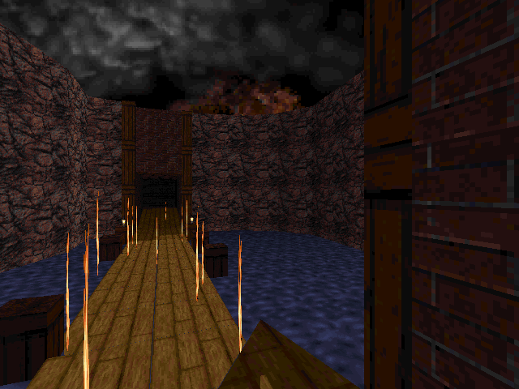
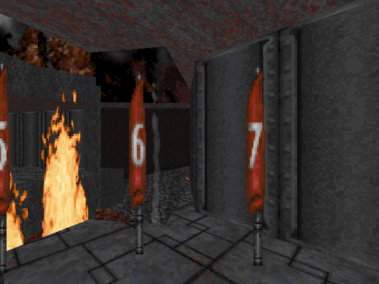

# E1M4 — one map, eight views, five disagreements

Blood's fourth level, *Phantom Express*: a carnival and a moving train. This
is the multi-view bundle — every reading the phases built, applied to one
map, with the places they contradict each other listed rather than resolved.

```text
bloodmap/bundle.py            the gatherer
reports/E1M4-bundle.json      the machine-readable bundle (370 KiB)
reports/E1M4-bundle-views/    the frames, from the XMapEdit observer
tests/test_bundle.py          smoke test, skips cleanly without the corpus
```

**No view here is canonical.** Each section names the module that produced it
and what that module assumes. Where two views disagree, both numbers stand.

## Why this map

It was E1M4 against E3M2 and E6M1. All three carry frontage; the count
decided it, and then the evidence did.

```text
map    sectors  facades  routes  keyed  irreversible  gib walls  lifts
E1M4       398       41      26      2             9          2      4
E3M2       567       39      65      1             7          1     29
E6M1       123       18      10      3             3          2      0
```

E3M2 exercises the conditional view harder — 65 routes and 29 lifts against
26 and 4. **E1M4 wins on checkability rather than volume**: it carries the
most facades of any candidate, and three of its mechanisms were verified in
Phase 9 against the raw XSECTOR *and* the editor renderer independently of
any code here — a crack, a keyed door, and a lift's neighbours. A bundle
whose cross-view claims can be checked against something outside itself is
worth more than a bundle with more rows. The trade-off given up is lift
variety: four here against E3M2's twenty-nine.

All eight views were gathered. None is missing.

---

## 1. Geometry

`bloodmap.spatial.analyze_spatial` — *assumes wall ownership and sector loops
as the MAP records them.*

```text
398 sectors   3651 walls   1091 sprites   995 portals
sector kinds: reachable 387   bare 9   logic_closet 2
```

Only two logic closets, which is unusual — the campaign average is far
higher. E1M4 wires most of its mechanisms in place.

## 2. Object assemblies — Phase 5

`bloodmap.assembly.assembly_around` — *assumes an assembly is what a sector
contains, references by marker, and is wired to by channel.*

**56 assemblies, 30 distinct shapes.** More than half the shapes occur once:
this map does not repeat its machinery.

## 3. Functional regions — Phase 6

`bloodmap.structures.detect_structures` — *assumes structure is recovered
from floor heights and portal adjacency; nothing about triggers or channels.*

```text
257 candidates over 191 of 398 sectors
overlook 164   embedded_shell 43   recess 37   pit 10   stepped_run 3
```

164 overlooks is the carnival: a fairground is a place you see across.

## 4. Facades — Phase 7

`bloodmap.anchors.find_facades` — *assumes a facade is a maximal collinear
run of one sky-lit sector's wall loop, at least two 1024 bays long.*

**41 facades: 37 single-opening, 2 repeating, 2 centered.** The longest is
12288 units (sector 352); the richest is sector 139's ten-thousand-unit
repeating run with three openings.



A cobbled alley between a lit train carriage and a loading dock. The three
openings the facade reading counts are the carriage doors on the left.

## 5. Effects and mechanisms — Phase 8

`bloodmap.effects.read_map_mechanisms` — *assumes the name comes from the
embedding, never the fields; rotate and slide are returned undecided.*

```text
56 mechanisms
  changes what fits through      15
  carries a body between levels   4
  both                            1
  neither                         7
  not decidable from z alone     29
```

**More than half are undecidable.** E1M4 is a train level: 29 of its
mechanisms slide or rotate, and no swept-area reading exists for those. The
view declines rather than guessing, which is why this number is here.

## 6. Conditional topology — Part A's blocking-aware base

`bloodmap.conditional.build_graph(base='blocking_aware')` — *assumes
portal_graph minus crossings whose wall carries the blocking cstat, plus
those blocking walls a kWallGib mechanism reopens.*

```text
27 Z-motion mechanisms   26 wired   1 inert
29 rotate/slide scoped out
26 routes    triggers: push 20, shot 9, switch 4, relay 2
16 blocking crossings    4 reopened by a gib wall    14 shut for ever
14 crossings passable in neither state
```

Two keyed routes and two breakable walls:

```text
sector 235  joins 234 <-> 236   requires the eye key
sector 295  joins 294 <-> 296   requires the moon key
wall   86   joins  14 <-> 396   kWallGib
wall  350   joins  44 <-> 320   kWallGib
```



The XSECTOR on sector 295 says `key=6`; `KEY_NAMES[6]` is `moon`; the
renderer paints a crescent lock plate on the wall. Three readings, none told
about the others.



Sector 245 holds crack sprite 373. Beyond it, sectors 276 and 277 sit flush —
ceiling equal to floor — until the crack is shot.

## 7. Progression frontier

`bloodmap.conditional.frontier` — *assumes rounds are ordered; the actions
inside a round are not, so this is not a play order.*

```text
start sector 102
at rest      253 sectors
finally      357 sectors    (104 gated behind an action)
5 rounds
```



## 8. Visual / readability

`tools.render_precedent` via the XMapEdit observer — *assumes a viewpoint is
placed only where a body has standing clearance at rest; a frame is what the
editor renderer painted with the local game data, not design intent.*

Eight frames written. **One sector refused**: 276, *"no interior point with
standing clearance"* — see the disagreements below.

---

# Disagreements

Five, and none of them is resolved here. Two readings of the same map built
on different evidence should disagree; a bundle that hides it is claiming a
consensus it has not got.

### 1. Conditional topology vs `sp_understand` — 357 against 278

The largest. Both ask what a body can end up reaching; they differ by 79
sectors, a fifth of the map.

They run on different base graphs. The conditional view gates on the wall
blocking cstat and reopens what a mechanism drives.
`analyze_progression` floods `spatial.walkable_at_rest`, which *also* refuses
portals under 512 wide or 4096 of opening, and — the material part — **never
reads `known_non_portal_transitions`**, so stack links and teleports are
invisible to it. Neither number is wrong given its own assumptions; they are
answers to different questions wearing the same name.

### 2. Effects vs conditional topology — 29 undecided against 29 scoped out

The two views refuse the same 29 mechanisms for the same reason: both ask
their spatial questions about a vertical opening, and E1M4's sliding train
cars have none. But they count different things — `effects` counts
mechanisms it declines to *name*, the conditional view counts mechanisms
whose crossings it leaves *ungated*. That the two numbers match here is a
coincidence of this map, not an identity.

Neither number says those mechanisms do nothing.

### 3. Facades vs functional regions — 4 sectors are both

Four sectors are read as a street frontage by one view and as a structural
shape by the other. A facade comes from a sky-lit sector's wall loop; a
structure from floor heights and adjacency. One sector being both is the two
views cutting the same space along different grains, which is the reason to
keep both rather than merge them.

### 4. Geometry vs conditional topology — 387 against 357

`sector_kinds` calls 387 sectors player space; the frontier reaches 357.
Thirty sectors look like places a player belongs and cannot be entered by
this traversal.

That is not necessarily an error in either. Of E1M4's blocking crossings, 14
are shut for ever — no gib wall, no mechanism, nothing in the engine that
clears a wall's blocking bit. And 29 mechanisms are sliding ones this view
does not gate, so a sector reachable only by riding a train car is player
space the frontier cannot enter.

### 5. Visual vs conditional topology — the renderer refuses sector 276

The observer would not place a viewpoint in 276: *no interior point with
standing clearance*. The conditional view calls 276 a way through, shut until
crack sprite 373 is destroyed.

**This disagreement is really an agreement**, and it is the most useful one
in the bundle. Two readings with no shared code — a geometric gate reading of
XSECTOR endpoints, and a renderer trying to find somewhere to put a camera —
independently say the same sector is not somewhere a body can be. Where a
view refuses to answer, that refusal is evidence.

---

## Limitations

- 29 of 56 mechanisms are undecided, so this bundle describes roughly half of
  E1M4's machinery. On a train level that is a large half to be missing.
- The JSON is 370 KiB and unabridged at the 400-record limit; nothing was
  trimmed for this map.
- `functional_regions` counts candidates, not verified structures — 164
  overlooks is a detector's output, not a claim that a designer drew 164
  vantage points.
- The frames are what the *editor* renderer painted with local game data.
  They are evidence about geometry and lighting, not about how the game
  looks in motion.
- The progression rounds are ordered; the actions within a round are not.
  This is not a route and not a play order.
- One map. Nothing here is a claim about the campaign.
